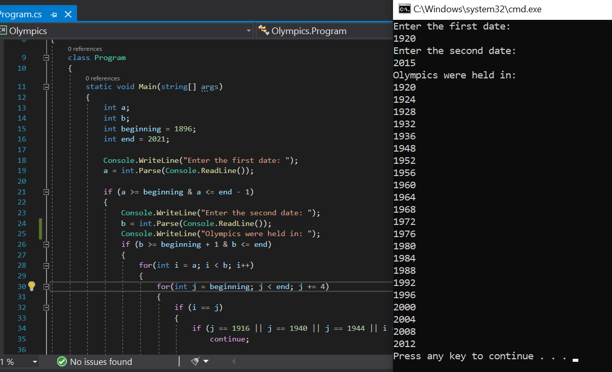

# Olympic Game Task :white_check_mark:

Olympic Games are being held since 1896. Since then they happen every 4 years except in 1916, 1940, 1944 and 2020 they were cancelled. The task is to enter to the console period of time to check the years when the Games
were held.
___

### Screenshots

    

