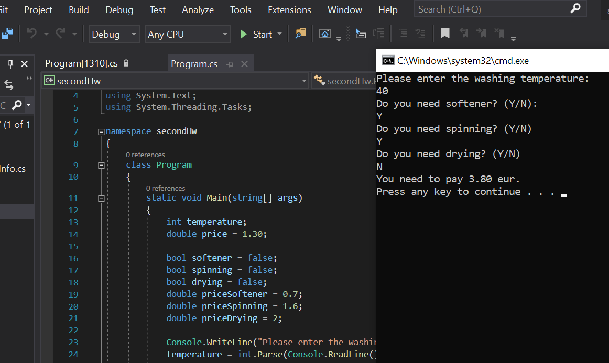

# Washing Machine Task :white_check_mark:

Nowadays there are quite a few programs washing machines have. Each client can generate his own program by choosing the temperature of water and using (or not using) softener, spinning program and/or drying.
If the temperature of the water is 30 degrees Celsius or less, it costs 1.3eur. Every additional degree costs additionally 2cnt. Softener costs 70cnt, spinning - 1.6eur, drying - 2eur.
The task is to find the price for the program made by client. All the information needs to be shown on the console.

___

### Screenshots

    

